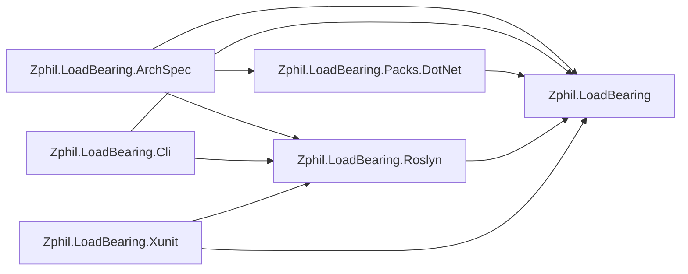

# Architecture

The projects that make up LoadBearing and the references between them, drawn by `loadbearing render`
from this solution rather than by hand. A solid arrow is a reference some type actually makes; a dotted
arrow is a project reference that is declared and never exercised.

<!-- loadbearing:begin -->
*Generated by `loadbearing render` from `Zphil.LoadBearing.slnx` — do not edit between the markers; re-render to update.*


<!-- loadbearing:end -->

Nobody drew that, and nobody can let it go stale:
[`SelfSpecTests.ArchitectureMd_IsCurrent`](https://github.com/andypgray/loadbearing/blob/main/tests/Zphil.LoadBearing.Tests/Dogfood/SelfSpecTests.cs)
composes the block in process and asserts the committed file already equals it. Only the shipping
projects are drawn; the fixture solutions the tests check against stay out of scope.

To redraw it from a checkout:

```bash
dotnet build Zphil.LoadBearing.slnx
loadbearing render Zphil.LoadBearing.slnx \
  --spec arch/Zphil.LoadBearing.ArchSpec/Zphil.LoadBearing.ArchSpec.csproj \
  --diagram ARCHITECTURE.md \
  --diagram-only "Zphil.LoadBearing;Zphil.LoadBearing.Cli;Zphil.LoadBearing.Roslyn;Zphil.LoadBearing.Xunit;Zphil.LoadBearing.Packs.DotNet;Zphil.LoadBearing.ArchSpec"
```
