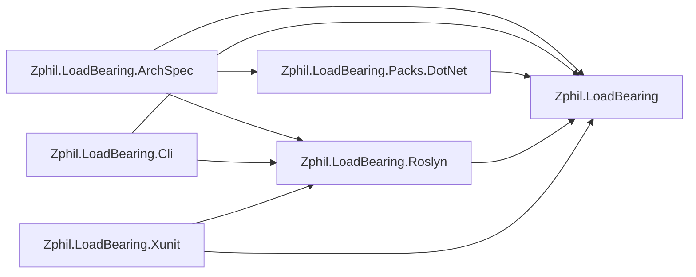

# Architecture

Two drawings of the same system, both written by `loadbearing render` rather than by hand.

The first is the codebase survey: the projects that make up LoadBearing and the references between
them, where a solid arrow is a reference some type actually makes and a dotted arrow is a project
reference that is declared and never exercised. It is drawn from what the code does.

The second is the architecture law, drawn from the spec instead: the places it names, the references
it forbids, the debt it grandfathers and the scope it contains. Its legend is generated with it, one
row for each construct that particular drawing uses.

<!-- loadbearing:begin -->
*Generated by `loadbearing render` from `Zphil.LoadBearing.slnx` — do not edit between the markers; re-render to update.*



*Generated by `loadbearing render` from `Zphil.LoadBearing.ArchSpec`. Do not edit between the markers; edit the spec and re-render.*

```mermaid
flowchart LR
    accTitle: Architecture law: Zphil.LoadBearing.ArchSpec
    accDescr: The places this spec names, the references it forbids, and the debt it grandfathers.

    subgraph s_Core["Core"]
        s_Model["Model"]
        s_Checking["Checking"]
        s_Rendering["Rendering"]
    end
    subgraph s_Extraction["Extraction"]
        subgraph s_Zphil_LoadBearing_Roslyn_MsBuild["Quarantine: roslyn/msbuild-bootstrap"]
            s_MsBuildBootstrap[["MsBuildBootstrap"]]
        end
    end
    s_Microsoft_CodeAnalysis("Microsoft.CodeAnalysis.*")
    s_Microsoft_Build("Microsoft.Build.*")
    s_Adapter["Adapter"]
    subgraph s_Host["Host"]
        s_Zphil_LoadBearing_Cli_Mcp_Infrastructure["Zphil.LoadBearing.Cli.Mcp.Infrastructure.*"]
    end
    s_Pack["Pack"]
    s_System_Environment("System.Environment")

    s_Core --x s_Extraction
    s_Core --x s_Microsoft_CodeAnalysis
    s_Core --x s_Microsoft_Build
    s_Model --x s_Checking
    s_Model --x s_Rendering
    s_Extraction --x|"expose"| s_Microsoft_Build
    s_Core --x s_Adapter
    s_Extraction --x s_Adapter
    s_Host --x s_Adapter
    s_Pack --x s_Adapter
    s_Pack -->|"only"| s_Core
    s_Zphil_LoadBearing_Cli_Mcp_Infrastructure -.-x|"grandfathered"| s_System_Environment

    subgraph l_legend["Legend"]
        l_ban["--x = must not reference"]
        l_expose["--x expose = must not expose on a public signature"]
        l_only["--> only = the only references allowed"]
        l_debt["-.-x grandfathered = Migrate debt, with the existing sites baselined"]
        l_quarantine["Quarantine box = a contained scope; the doubled boxes are its sanctioned surface"]
        l_outside["Rounded box = a place named only as the target of a rule"]
        l_nesting["A box inside a box = the inner place is part of the outer"]
    end
```



Not drawn in full: `cli/no-stdout`, `di/no-captive-dependencies`, `di/no-service-locator`, `di/no-buildserviceprovider`, `mcp/tools-accept-cancellation`, `mcp/tool-types-attributed`, `roslyn/no-msbuildlocator-query`, `mcp/no-blocking-waits`, `mcp/no-path-assembly-loads`, `naming/async-suffix`, `mcp/warm-state-constructed-once`, `xunit/throws-setup-errors-only`, `exceptions/no-swallowed-broad-catches`, `exceptions/no-bare-bcl-throws`, `naming/interfaces`, `model/constraint-nodes`, `roslyn/msbuild-bootstrap/tripwire` (Quarantine). Expand any of them with `loadbearing explain <rule-id>`.
<!-- loadbearing:end -->

Nobody drew either of those, and nobody can let them go stale:
[`SelfSpecTests.ArchitectureMd_IsCurrent`](https://github.com/andypgray/loadbearing/blob/main/tests/Zphil.LoadBearing.Tests/Dogfood/SelfSpecTests.cs)
composes the block in process and asserts the committed file already equals it.

The two fences are scoped differently, which the redraw command below shows. The survey fence draws
the projects this solution file declares, which is why the MyApp fixture solutions the tests check
against are absent from it: a spec fixture's project reference drags them into the build, and the
solution never claims them. `--diagram-only` and `--diagram-exclude` narrow within that set and
nothing else. They earn their place here on legibility rather than correctness: nineteen declared
projects would be drawn against a readability guardrail of roughly twenty nodes, so the enumeration
below keeps the picture to the four shipping packages, the rule pack and the spec. The law fence is
never scoped, because what the spec forbids is not a property of the projects someone chose to draw.
So the law can name a place the survey dropped. That is the pair being honest, not the two
disagreeing.

The line under the law fence lists the rules no diagram can place. A rule about a name, a shape, an
attribute or a member has no arrow to draw, so it is named there by ID and expanded with
`loadbearing explain`. Nothing is silently left out.

To redraw both from a checkout:

```bash
dotnet build Zphil.LoadBearing.slnx
loadbearing render Zphil.LoadBearing.slnx \
  --spec arch/Zphil.LoadBearing.ArchSpec/Zphil.LoadBearing.ArchSpec.csproj \
  --diagram ARCHITECTURE.md \
  --diagram-only "Zphil.LoadBearing;Zphil.LoadBearing.Cli;Zphil.LoadBearing.Roslyn;Zphil.LoadBearing.Xunit;Zphil.LoadBearing.Packs.DotNet;Zphil.LoadBearing.ArchSpec"
```
