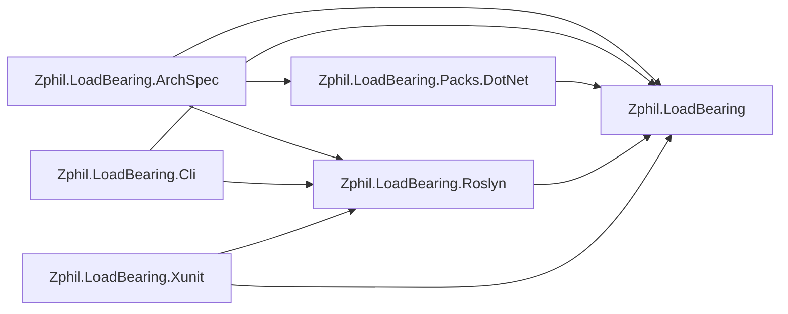

# LoadBearing

<!-- mcp-name: io.github.andypgray/loadbearing -->

[](https://github.com/andypgray/loadbearing/actions/workflows/ci.yml) [](https://scorecard.dev/viewer/?uri=github.com/andypgray/loadbearing) [](https://www.nuget.org/packages/Zphil.LoadBearing.Cli) [](https://www.nuget.org/packages/Zphil.LoadBearing.Cli)

LoadBearing is a .NET tool that renders one C# architecture spec to two targets: enforcement and agent context.

1. **Enforcement**: one checker passes or fails the rules at the command line, in CI, as named xUnit tests, and in an agent hook after each edit.
2. **Agent context**: the same rules render to a managed `AGENTS.md` block, per-directory rule cards, and MCP query tools for coding agents.

Write your architecture once. Use it everywhere.

LoadBearing is pre-alpha and under construction; [Status](#status) holds the current inventory.

## One spec produces

Each target below consumes the same reified model, and every violation report carries the rule ID, the generated rule sentence, the reason, the fix, and the exact `file:line`.

| Target | What it is |
|---|---|
| `loadbearing check` | one pass-or-fail verdict for the command line and CI |
| `check --sarif` | that verdict as SARIF 2.1.0, for code scanning |
| xUnit adapter | every rule an individually named test |
| `loadbearing render` | the managed `AGENTS.md` block and per-directory rule cards |
| `loadbearing mcp` | `arch_check`, `arch_status`, `arch_explain`, `arch_context`, and `arch_graph`, plus a `derive_spec` prompt |
| agent hook | `check` after each edit; a red rule blocks it, report on stderr |

The adapter's failure text is byte-identical to the CLI's: the two share one renderer, and a product test pins them equal. The managed block plus `loadbearing explain` are also the generated architecture documentation, written for agents first and readable by people; the gate under [The prose it generates](#the-prose-it-generates) keeps it current.

The compiler is the source of truth for your code. LoadBearing is the source of truth for your architecture.

## This repo's own spec

LoadBearing governs itself. Eighteen rules over this repository's real code, across eight declared layers, live in [`LoadBearingArchSpec.cs`](https://github.com/andypgray/loadbearing/blob/main/arch/Zphil.LoadBearing.ArchSpec/LoadBearingArchSpec.cs), and every fence from here down to [This page is tested](#this-page-is-tested) is that spec, or this solution under it, on one surface after another. Take the rule that keeps the CLI off stdout — `host` is the layer the CLI project's namespace defines:

```csharp
        arch.Rule("cli/no-stdout")
            .Enforce(host
                .MustNotUse(
                    arch.Member(() => Console.Out),
                    arch.Member(typeof(Console), nameof(Console.Write)),
                    arch.Member(() => Console.WriteLine())))
            .Because("Stdout is a protocol channel here — the MCP server speaks JSON-RPC over it and CLI " +
                     "output flows through System.CommandLine's console — so a direct Console write corrupts " +
                     "the wire and is invisible to the in-process tests.")
            .Fix("Write CLI output through the command's InvocationConfiguration console; route server " +
                 "diagnostics to the logger or Console.Error.");
```

A rule is a posture verb (`Enforce`), a modal constraint (`MustNotUse`), an ID, and a `Because`. Nothing in the build system stops the CLI writing to `Console`, and the MCP server on the other side of that stdout speaks JSON-RPC over it. This rule is the only thing standing between those two facts.

## The prose it generates

`loadbearing render` derives the rule sentence from the constraint, carries the `Because` across verbatim, and writes the result into the managed block of this repository's committed [`AGENTS.md`](https://github.com/andypgray/loadbearing/blob/main/AGENTS.md), the convention file Claude Code, Codex, Cursor, and Copilot read:

```markdown
- `cli/no-stdout` — The Host layer must not use `Console.Out`, `Console.Write()` or `Console.WriteLine()`. Stdout is a protocol channel here — the MCP server speaks JSON-RPC over it and CLI output flows through System.CommandLine's console — so a direct Console write corrupts the wire and is invisible to the in-process tests.
```

Nobody wrote that sentence, and nobody can let it go stale: [`SelfSpecTests.AgentsMd_IsCurrent`](https://github.com/andypgray/loadbearing/blob/main/tests/Zphil.LoadBearing.Tests/Dogfood/SelfSpecTests.cs) composes the block in process and asserts the committed file already equals it. Its sibling `ScopedCards_AreCurrent` holds the whole class the same way, every per-directory card this repository commits, and also fails on a card that no rule placement produced, so one orphaned by a spec change cannot stay behind being read. The prose an agent reads is provably the spec the build enforces. Agents that query rather than read get the same model over MCP (`loadbearing mcp`).

## When an agent breaks it

Suppose an agent adds a progress printer to the CLI so a slow solution load stops looking hung, and reaches for `Console.WriteLine`. The `PostToolUse` hook in [`hooks/`](https://github.com/andypgray/loadbearing/tree/main/hooks) runs `check` on the edit, the rule goes red, and the wrapper exits 2, which is how a Claude Code hook blocks, with the report on the agent's stderr:

```text
FAIL cli/no-stdout — The Host layer must not use `Console.Out`, `Console.Write()` or `Console.WriteLine()`.
  because: Stdout is a protocol channel here — the MCP server speaks JSON-RPC over it and CLI output flows through System.CommandLine's console — so a direct Console write corrupts the wire and is invisible to the in-process tests.
  fix: Write CLI output through the command's InvocationConfiguration console; route server diagnostics to the logger or Console.Error.
  src/Zphil.LoadBearing.Cli/Rendering/ProgressPrinter.cs:10 — Zphil.LoadBearing.Cli.Rendering.ProgressPrinter uses System.Console.WriteLine()
  src/Zphil.LoadBearing.Cli/Rendering/ProgressPrinter.cs:15 — Zphil.LoadBearing.Cli.Rendering.ProgressPrinter uses System.Console.WriteLine()
```

That stanza is one rule's worth of the twenty-rule board the wrapper hands back whole. It carries the four things an agent needs to act without asking a human: the rule ID, the reason, the fix, and the exact `file:line` of every offending write. The agent routes the output through the command's console instead, the next check is green, and the block clears in the same turn, before the change lands.

## In xUnit

The same spec runs inside a test project, where a team already looks. `ArchRuleTests<TSpec>` from the xUnit adapter turns each rule into an individually named test, and this repository's whole adapter dogfood is [one class declaration](https://github.com/andypgray/loadbearing/blob/main/tests/Zphil.LoadBearing.Tests/Dogfood/AdapterSelfSpecTests.cs):

```csharp
[Collection("Serial")]
public sealed class AdapterSelfSpecTests : ArchRuleTests<LoadBearingArchSpec>
{
    protected override string SolutionPath => FindSolutionUp("Zphil.LoadBearing.slnx");
}
```

Each test's display name is its rule ID, so a broken rule is named in the run summary rather than buried in an assertion message, and a `Migrate` rule's grandfathered sites keep their test green while the ratchet holds. [CI](https://github.com/andypgray/loadbearing/blob/main/.github/workflows/ci.yml) runs it as a step of its own, "Self-spec as named xUnit tests (one test per rule)", whose log carries one line per rule ID.

## As SARIF

`check --sarif` writes the same verdict as SARIF 2.1.0, which is what GitHub code scanning reads. This repository's one `Migrate` rule is retiring direct `System.Environment` reads out of the MCP infrastructure, over a counted baseline:

```csharp
        arch.Rule("mcp/env-through-seam")
            .Migrate(
                "MCP infrastructure reads process env vars via System.Environment directly.",
                arch.Types.InNamespace("Zphil.LoadBearing.Cli.Mcp.Infrastructure.*")
                    .Except(arch.Types.WithNameMatching("SystemEnvironment"))
                    .MustNotReference(typeof(Environment)))
            .Because("A single IEnvironment seam keeps the MCP pipeline testable without mutating real " +
                     "process state.")
            .Fix("Inject IEnvironment (see SystemEnvironment); read via GetVariable.");
```

Its four baselined sites keep the rule green at the command line and still reach code scanning, as note-level results marked suppressed, so the burndown is visible to anyone reviewing without ever failing a build. One result object from a fresh run:

```json
{
  "ruleId": "mcp/env-through-seam",
  "level": "note",
  "message": {
    "text": "Zphil.LoadBearing.Cli.Mcp.Infrastructure.IdleTimeoutWatchdog references System.Environment"
  },
  "locations": [
    {
      "physicalLocation": {
        "artifactLocation": {
          "uri": "src/Zphil.LoadBearing.Cli/Mcp/Infrastructure/IdleTimeoutWatchdog.cs",
          "uriBaseId": "SRCROOT"
        },
        "region": {
          "startLine": 109
        }
      }
    }
  ],
  "partialFingerprints": {
    "loadBearingViolationIdentity/v1": "v1|T:Zphil.LoadBearing.Cli.Mcp.Infrastructure.IdleTimeoutWatchdog|T:System.Environment||src/Zphil.LoadBearing.Cli/Mcp/Infrastructure/IdleTimeoutWatchdog.cs|0"
  },
  "baselineState": "unchanged",
  "suppressions": [
    {
      "kind": "external",
      "justification": "grandfathered in arch/baselines/mcp/env-through-seam.json"
    }
  ]
}
```

A rule that is genuinely red lands the same shape at `error` level, with `"baselineState": "new"` and no `suppressions` array, so a reviewer can tell house debt from a fresh breach at a glance. Reproduce the file from a checkout:

```bash
dotnet build Zphil.LoadBearing.slnx
loadbearing check Zphil.LoadBearing.slnx --spec arch/Zphil.LoadBearing.ArchSpec/Zphil.LoadBearing.ArchSpec.csproj --sarif loadbearing.sarif
```

CI's [`self-check` job](https://github.com/andypgray/loadbearing/blob/main/.github/workflows/ci.yml) runs that check on every push and uploads the SARIF it writes.

## The graph

`loadbearing graph` surveys the codebase a spec is written against: projects and their references, namespaces and their sizes, every external dependency by root. Five of the twenty project lines for this solution:

```text
  Zphil.LoadBearing — 192 types; references: (none)
  Zphil.LoadBearing.ArchSpec — 1 type; references: Zphil.LoadBearing, Zphil.LoadBearing.Packs.DotNet, Zphil.LoadBearing.Roslyn
  Zphil.LoadBearing.Cli — 120 types; references: Zphil.LoadBearing, Zphil.LoadBearing.Roslyn
  Zphil.LoadBearing.Roslyn — 78 types; references: Zphil.LoadBearing
  Zphil.LoadBearing.Xunit — 2 types; references: Zphil.LoadBearing, Zphil.LoadBearing.Roslyn
```

The `references: (none)` on the first line is `layering/core-no-roslyn` seen from the other side: the rule forbids the reified model from reaching for the Roslyn project or the compiler packages behind it, and the survey shows it reaching for no other project in the solution. The lines not shown here are the test project, the rule pack, and the fixture projects the tests check against.

`render --diagram <path>` draws that same survey as a Mermaid diagram inside a committed file's managed block. Pointed at this repository and scoped to its six shipping projects, it writes [`ARCHITECTURE.md`](https://github.com/andypgray/loadbearing/blob/main/ARCHITECTURE.md):



A solid arrow is a reference some type actually makes; a dotted arrow is a project reference that is declared and never exercised, which the text survey leaves you to work out by reading two of its sections against each other. There are no dotted arrows above, which is itself the report: no project here declares a reference it never uses. Nobody drew that diagram, and nobody can let it rot: [`SelfSpecTests.ArchitectureMd_IsCurrent`](https://github.com/andypgray/loadbearing/blob/main/tests/Zphil.LoadBearing.Tests/Dogfood/SelfSpecTests.cs) composes the block in process and asserts the committed file already equals it. A hand-drawn architecture diagram is the artifact that rots first; this one is held to the code the same way the rules are.

That fence is drawn from what the code does. The same block carries a second one, drawn from what the spec forbids:

```mermaid
flowchart LR
    accTitle: Architecture law: Zphil.LoadBearing.ArchSpec
    accDescr: The places this spec names, the references it forbids, and the debt it grandfathers.

    subgraph s_Core["Core"]
        s_Model["Model"]
        s_Checking["Checking"]
        s_Rendering["Rendering"]
    end
    subgraph s_Extraction["Extraction"]
        subgraph s_Zphil_LoadBearing_Roslyn_MsBuild["Quarantine: roslyn/msbuild-bootstrap"]
            s_MsBuildBootstrap[["MsBuildBootstrap"]]
        end
    end
    s_Microsoft_CodeAnalysis("Microsoft.CodeAnalysis.*")
    s_Microsoft_Build("Microsoft.Build.*")
    s_Adapter["Adapter"]
    subgraph s_Host["Host"]
        s_Zphil_LoadBearing_Cli_Mcp_Infrastructure["Zphil.LoadBearing.Cli.Mcp.Infrastructure.*"]
    end
    s_Pack["Pack"]
    s_System_Environment("System.Environment")

    s_Core --x s_Extraction
    s_Core --x s_Microsoft_CodeAnalysis
    s_Core --x s_Microsoft_Build
    s_Model --x s_Checking
    s_Model --x s_Rendering
    s_Extraction --x|"expose"| s_Microsoft_Build
    s_Core --x s_Adapter
    s_Extraction --x s_Adapter
    s_Host --x s_Adapter
    s_Pack --x s_Adapter
    s_Pack -->|"only"| s_Core
    s_Zphil_LoadBearing_Cli_Mcp_Infrastructure -.-x|"grandfathered"| s_System_Environment

    subgraph l_legend["Legend"]
        l_ban["--x = must not reference"]
        l_expose["--x expose = must not expose on a public signature"]
        l_only["--> only = the only references allowed"]
        l_debt["-.-x grandfathered = Migrate debt, with the existing sites baselined"]
        l_quarantine["Quarantine box = a contained scope; the doubled boxes are its sanctioned surface"]
        l_outside["Rounded box = a place named only as the target of a rule"]
        l_nesting["A box inside a box = the inner place is part of the outer"]
    end
```



Nothing in that drawing is a shape somebody chose for it. A bare `--x` is a reference this spec forbids, the labelled arrows are the verbs that need naming, the dotted one is the single Migrate rule with its existing sites baselined, and the box inside Extraction is the quarantined scope with its sanctioned surface doubled. Model, Checking and Rendering sit inside Core because Core's globs contain theirs. The legend is generated with the rest, one row per construct this particular drawing uses.

The line under the fence is the honest part. A diagram can only draw a rule whose subject and targets are *places*, and most of this spec's rules are about shapes, names, attributes and members instead. Those rules are listed by ID rather than quietly dropped, so the picture is never mistaken for the whole law.

## This page is tested

The excerpts above are under gate. [`RootReadmeQuoteSyncTests`](https://github.com/andypgray/loadbearing/blob/main/tests/Zphil.LoadBearing.Tests/DocHygiene/RootReadmeQuoteSyncTests.cs) holds each quoted excerpt to the committed file it was cut from, every line in order as a verbatim substring: change the spec and leave this page alone, and the suite goes red. [`ReadmeAnchorGateTests`](https://github.com/andypgray/loadbearing/blob/main/tests/Zphil.LoadBearing.Tests/DocHygiene/ReadmeAnchorGateTests.cs) resolves the `file:line` anchors inside the quoted reports against the sources they name. The four fences that are captured tool output with no committed counterpart, the hook report and the SARIF object and the graph survey and the Framework check, are registered as such and held to their place on the page, so an exemption cannot quietly go dead.

The page is the tool's output, and the [CI badge](https://github.com/andypgray/loadbearing/actions/workflows/ci.yml) at the top is what keeps it that way.

## Where this sits next to ArchUnitNET and NetArchTest

[NetArchTest](https://github.com/BenMorris/NetArchTest) and [ArchUnitNET](https://github.com/TNG/ArchUnitNET) run architecture rules inside your unit tests, and they are good at it. LoadBearing moves the rules out of test code into one spec and renders every surface above from it.

| Tool | What you write | Where it runs |
|---|---|---|
| NetArchTest | fluent assertions in test methods | your test runner |
| ArchUnitNET | ArchUnit-style rules in test classes | your test runner |
| LoadBearing | one spec in its own project | every target above |

The grammar comes from surveying that prior art, and [GRAMMAR.md](https://github.com/andypgray/loadbearing/blob/main/GRAMMAR.md) records each divergence. Constraints negate in the verb (`MustNotReference`), following ArchUnitNET. If you know ArchUnit's `FreezingArchRule`: what freezing does (accept a rule's current violations as a baseline) is `Migrate` with its counted baseline here. `Quarantine` contains a scope; it does not accept the scope's violations.

`Because` is mandatory. A rule without one is an invalid spec: `check` refuses to run it and reports every spec error in one pass. Even the predicate escape hatch, `Must(condition, description:)`, does not compile without its description. Every reason ships to your agents in the rendered context, and in the [Interchange example](https://github.com/andypgray/loadbearing/tree/main/examples/Meridian.Interchange) each of the twelve rules' `Because` cites the learn.microsoft.com page it enforces. Nine of those twelve come from a shared rule pack, which is an ordinary class library of static methods: the pack owns the citation, the spec picks the posture.

## The three postures

Every rule carries one.

| Posture | What it is | What fails |
|---|---|---|
| `Enforce` | the law | every violation, even ones predating the rule |
| `Migrate` | a ratchet over a counted baseline | new violations; baselined sites stay quiet |
| `Quarantine` | containment for a scope | a new reference into the scope |

`Enforce` failing violations that predate it is what `Migrate` exists for: `loadbearing baseline` records a rule's current violations, new ones fail from the next commit, and the baseline only shrinks. At zero, the tool suggests promoting the rule to `Enforce`. A `Quarantine` scope also carries a diff-aware tripwire: with `check --diff-base <ref>`, a change set that touches the scope itself draws a warning.

## Starting on a codebase that already exists

LoadBearing is built for long-lived, business-critical .NET codebases: systems too important to rewrite, with an architecture that is real but written down nowhere. Start where the code is:

1. Write the rules the code should hold; state the ones it does not hold yet as `Migrate`.
2. `loadbearing baseline` records every current violation on a counted, committed baseline.
3. New code in the old pattern fails from the next commit; recorded sites stay quiet.
4. Migrate recorded sites as you touch them.
5. At zero, promote the rule to `Enforce`.

[The Meridian adoption walkthrough](https://github.com/andypgray/loadbearing/blob/main/examples/Meridian/ADOPTING.md) is this flow on a committed example codebase, one real command at a time.

## .NET Framework

The tool runs on .NET 10. The codebase it checks does not have to, and neither does the spec that governs it.

A spec project can target `net48` and compile at that framework's default language level, C# 7.3. It references the same netstandard2.0 `Zphil.LoadBearing` package every other spec does, and the CLI loads the built DLL in an isolated load context. A `typeof()` anchor works from there while the anchored type's own closure stays inside netstandard2.0; past that line, including .NET Framework types with no counterpart on .NET, a namespace pattern is the anchor, and it needs no assembly load at all.

Old project files load too. A non-SDK-style Framework project, the kind in the 2003 MSBuild XML namespace with explicit `<Reference>` items and a hand-maintained `AssemblyInfo.cs`, loads through the .NET Framework build host Roslyn ships and reports at `file:line` like anything else:

```text
FAIL data-access/no-inline-sql — Types in `Classic.*` must not reference types in `System.Data.*`.
  Classic.Billing/BillingCalculator.cs:10 — Classic.Billing.BillingCalculator references System.Data.SqlClient.SqlConnection
```

And the build server can stay where it is. `check --binlog` replays a binary log from a real build, including one produced by .NET Framework `MSBuild.exe`, so the machine that builds needs no .NET 10; only the machine that analyses does. Replaying that log and opening the workspace directly produce byte-identical output, which is what makes the replay a shortcut rather than a lesser reading.

The last two both need Windows with Visual Studio or Build Tools installed, because that is where the Framework build host and `MSBuild.exe` come from. A net48 spec project carries no such requirement and builds anywhere.

## Examples

Six worked examples in [`examples/`](https://github.com/andypgray/loadbearing/tree/main/examples) share one fictional freight-forwarding company. Four are solutions: CI builds each one, holds `check` green against the committed tree, and re-renders every managed block under `examples/` to prove a zero diff. The other two walk a flow with captured output. Three are whole codebases:

- [Enforce-only clean architecture](https://github.com/andypgray/loadbearing/tree/main/examples/Meridian.Quoting): the greenfield quoting subsystem. Nine rules hold a four-layer clean architecture, and every rule runs as a named xUnit test.
- [All three postures on one codebase](https://github.com/andypgray/loadbearing/tree/main/examples/Meridian): a mid-migration monolith where six of eight controllers still run inline SQL. The law, three ratchets and their burndown, one quarantined scope.
- [Module isolation as law](https://github.com/andypgray/loadbearing/tree/main/examples/Meridian.Operations): a modular monolith. Every module directory carries its own rendered rule card, and one module is quarantined behind its facade.

Three go deeper on one surface each:

- [Microsoft guidance, enforced and cited](https://github.com/andypgray/loadbearing/tree/main/examples/Meridian.Interchange): the cookbook page. Canon sentence, spec excerpt, and real violation, rule by rule.
- [Day-one adoption on an existing codebase](https://github.com/andypgray/loadbearing/blob/main/examples/Meridian/ADOPTING.md): the full derive flow, every step a real command with real output.
- [The agent loop, closed by a hook](https://github.com/andypgray/loadbearing/tree/main/examples/Meridian/hooks): the storyboard for the loop above, walked beat by beat with captured output, plus the wrapper scripts and the paste-in hook config.

## Installing

The CLI ships as a .NET global tool:

```bash
dotnet tool install -g Zphil.LoadBearing.Cli
loadbearing check MyApp.sln
```

The machine running it needs a .NET 10 SDK: commands that load a solution (`check`, `render`, `status`, `graph`, `baseline`, `mcp`) do so through MSBuildWorkspace via MSBuildLocator, and a runtime-only environment cannot host that load. The codebase under check has no version requirement of its own: LoadBearing never builds or retargets it (restore and build it first; the checker never builds, and stale builds give stale verdicts), and it can target .NET Framework 4.8 or anything newer. The spec project compiles against one package, `Zphil.LoadBearing`, which is netstandard2.0.

The command is `loadbearing`. Four lockstep-versioned packages make up a release:

| Package | What it is |
|---|---|
| [`Zphil.LoadBearing.Cli`](https://www.nuget.org/packages/Zphil.LoadBearing.Cli) | The `loadbearing` global tool: `check`, `render`, `explain`, `status`, `graph`, `baseline`, and the MCP server (`loadbearing mcp`). |
| [`Zphil.LoadBearing`](https://www.nuget.org/packages/Zphil.LoadBearing) | The spec contract, zero dependencies; the one package a spec project references. |
| [`Zphil.LoadBearing.Xunit`](https://www.nuget.org/packages/Zphil.LoadBearing.Xunit) | The xUnit adapter: every rule as an individually named test. |
| [`Zphil.LoadBearing.Roslyn`](https://www.nuget.org/packages/Zphil.LoadBearing.Roslyn) | Extraction/workspace infrastructure; a dependency of the above, not for direct reference. |

MCP clients can also launch the server straight from nuget.org without a global install:
`dnx Zphil.LoadBearing.Cli -- mcp <solution>` (how MCP-registry clients run it; note the
`mcp` subcommand).

## Building

```bash
dotnet build Zphil.LoadBearing.slnx
dotnet test Zphil.LoadBearing.slnx
```

## Status

Pre-alpha, under construction. What this page shows is what exists: the reified model, the fluent builder, Roslyn extraction, the CLI verbs, the SARIF writer, the xUnit adapter, the MCP server, and the render pipeline, with all three postures evaluating. The spec excerpts above are quoted from this repository's own committed spec, the tool output is captured from runs against this solution, and CI uploads that `check --sarif` run to code scanning. The fluent surface can still move; [GRAMMAR.md](https://github.com/andypgray/loadbearing/blob/main/GRAMMAR.md) is its spec.

## License

[MIT](https://github.com/andypgray/loadbearing/blob/main/LICENSE)
