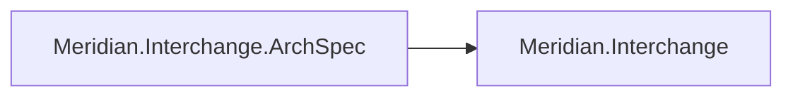
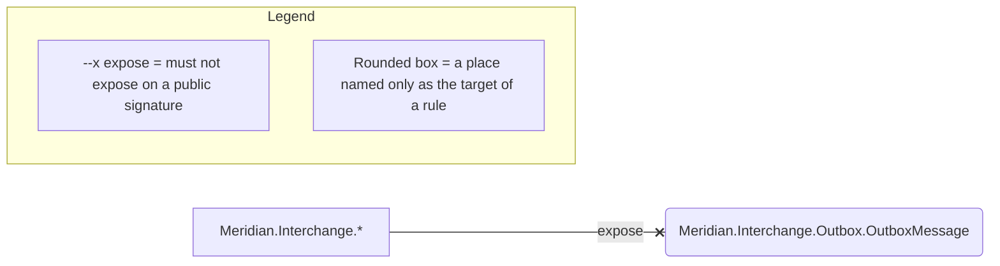

# Architecture: Meridian.Interchange

Two drawings of the same worker, both written by `loadbearing render` rather than by hand. Read this
before the fence, because this is the thin one and the thinness is the lesson.

Twelve rules hold Meridian.Interchange and eleven of them draw nothing. That is not a gap in the
drawing. Canonical .NET guidance is almost entirely non-spatial: reuse an `HttpClient`, do not
resolve services from the provider, do not capture a scoped dependency in a singleton, accept a
`CancellationToken`, suffix a `Task`-returning method with `Async`. Every one of those is about how a
type is built, called or named. None is a relation between two regions of code, so none has an
arrow.

The list under the fence is where the law of this subsystem lives, and
`loadbearing explain <rule-id>` is how it is read.

<!-- loadbearing:begin -->
*Generated by `loadbearing render` from `Meridian.Interchange.slnx` — do not edit between the markers; re-render to update.*



*Generated by `loadbearing render` from `Meridian.Interchange.ArchSpec`. Do not edit between the markers; edit the spec and re-render.*



Not drawn in full: `di/construct-via-container`, `http/reuse-httpclient`, `di/no-service-locator`, `di/no-buildserviceprovider`, `async/no-sync-over-async` (Migrate), `di/hosted-services-scope-their-work`, `di/no-captive-dependencies`, `naming/async-suffix`, `exceptions/no-general-catch`, `async/accept-cancellation`, `persistence/no-mapping-attributes`. Expand any of them with `loadbearing explain <rule-id>`.
<!-- loadbearing:end -->

The one rule with a direction is `contracts/no-entity-exposure`, and it earns the fence on its own.
`OutboxMessage` is a persisted entity, and the rule says no public signature outside the `Outbox`
namespace may hand one out. That is a relation between two places, so it draws: an `expose` arrow
from the subsystem to the type it must keep to itself. The rounded box is how the drawing marks a
place named only as the target of a rule, which is what `OutboxMessage` is here. The law points at
it; the law does not govern what happens inside it.

The other eleven are named by ID and expanded on demand. Nine of them come from a shared rule pack
rather than being written here, so `explain` prints the pack's reason together with the
learn.microsoft.com page behind it. A spec whose rules are mostly citations produces a page that is
mostly citations, and no drawing can carry a citation.

That is the honest shape of the pair on this codebase. The tool says so rather than drawing
something that would look fuller than the law is.

To redraw both from a checkout:

```bash
dotnet build examples/Meridian.Interchange/Meridian.Interchange.slnx
loadbearing render examples/Meridian.Interchange/Meridian.Interchange.slnx \
  --diagram examples/Meridian.Interchange/ARCHITECTURE.md \
  --diagram-only "Meridian*"
```
