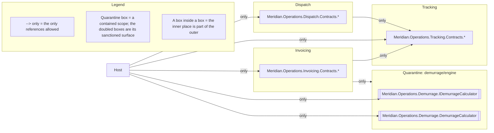

# Architecture: Meridian.Operations

Two drawings of the same subsystem, both written by `loadbearing render` rather than by hand, and
they do not look alike. The survey has two nodes. The law fence has ten.

That asymmetry is the point of this page. Meridian.Operations is one web project holding five
modules, and only the first of those two facts is something MSBuild knows. The modules are namespace
subtrees inside a single assembly, so the survey, drawn from projects and the references between
them, can see the project and nothing finer. The law fence is drawn from the spec, and the spec
names the modules. The law fence is the module map.

<!-- loadbearing:begin -->
*Generated by `loadbearing render` from `Meridian.Operations.slnx` — do not edit between the markers; re-render to update.*


*Generated by `loadbearing render` from `Meridian.Operations.ArchSpec`. Do not edit between the markers; edit the spec and re-render.*



Not drawn in full: `modules/dispatch/internals`, `modules/tracking/internals`, `modules/tracking/outbound`, `modules/tracking/event-naming`, `modules/invoicing/internals`, `demurrage/engine/tripwire` (Quarantine). Expand any of them with `loadbearing explain <rule-id>`.
<!-- loadbearing:end -->

Every arrow in the law fence is an `only` arrow, which is how a module graph is written here: a
module lists the places it may reach, and everything unlisted is forbidden. `Dispatch` reaches
`Tracking.Contracts` and nothing more. `Invoicing` reaches `Tracking.Contracts` and the demurrage
scope. `Host` is the composition root, so it reaches all three `Contracts` surfaces plus the
demurrage calculator facade. Each `Contracts` box sits inside its module because that is where it
lives: the inner box is part of the outer one.

The graph is acyclic because none of those allow-lists points back, and the drawing is where that is
easiest to check. Follow the arrows and there is no way home.

Four rules that are genuinely about the module graph appear under the fence rather than in it, and
they are the interesting half of that list. `modules/tracking/outbound` says tracking may reference
tracking and nothing else, which is how this language spells "tracking is the leaf". The three
`internals` rules each say that a module's interior, once its `Contracts` surface is excepted, may be
referenced only from inside that same module. In all four the subject and the one permitted target
are the same place, so there is no second place to draw an arrow to, and a self-arrow would tell a
reader nothing. They are named instead, which is what keeps the claim on this page total: every rule
in this spec is either drawn or listed.

The other two are `modules/tracking/event-naming`, which is about a type shape, and the quarantine
tripwire, which has nothing to draw by design. `loadbearing explain <rule-id>` expands any of them.

To redraw both from a checkout:

```bash
dotnet build examples/Meridian.Operations/Meridian.Operations.slnx
loadbearing render examples/Meridian.Operations/Meridian.Operations.slnx \
  --diagram examples/Meridian.Operations/ARCHITECTURE.md \
  --diagram-only "Meridian*"
```
