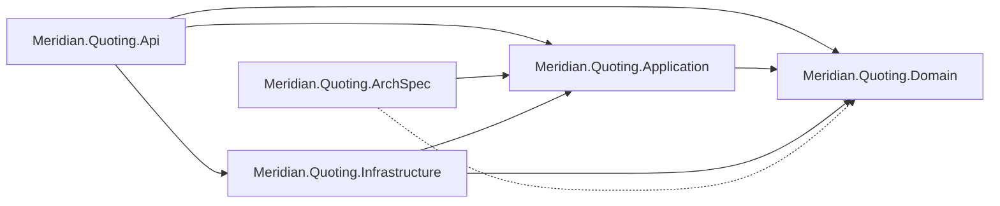
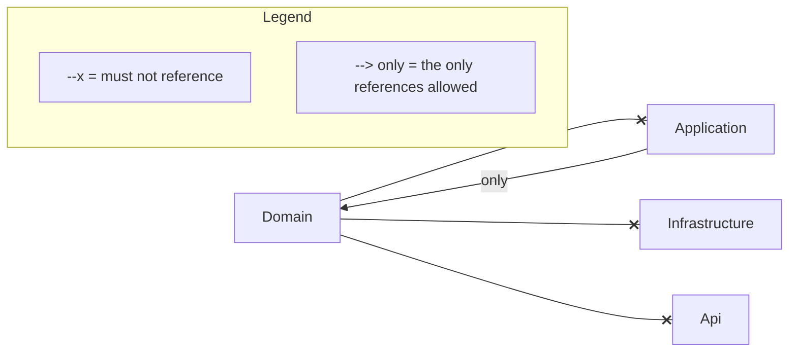

# Architecture: Meridian.Quoting

Two drawings of the same subsystem, both written by `loadbearing render` rather than by hand. The
first is the codebase survey, drawn from what the code does: four layers, the spec project, and the
references between them. The second is the architecture law, drawn from the spec.

This is the tidiest law in the example set and it has the emptiest drawing. That is not a
contradiction. It is what the pair is for.

<!-- loadbearing:begin -->
*Generated by `loadbearing render` from `Meridian.Quoting.slnx` — do not edit between the markers; re-render to update.*



*Generated by `loadbearing render` from `Meridian.Quoting.ArchSpec`. Do not edit between the markers; edit the spec and re-render.*



Not drawn in full: `naming/interfaces`, `naming/controllers`, `handlers/naming`, `handlers/transactional`, `persistence/repository-ports`, `messaging/immutable-messages`, `time/injected-clock`. Expand any of them with `loadbearing explain <rule-id>`.
<!-- loadbearing:end -->

Nine rules hold this subsystem and two of them have an arrow to draw. `layering/domain-independent`
is the three solid bans out of `Domain`, and `layering/application-boundaries` is the single `only`
arrow, which says `Application` may reach `Domain` and nothing further. Every other rule is about a
name, a shape, an attribute or a call: an interface prefix, a controller suffix, a `[Transactional]`
marker, a record, a wall-clock read. Those seven are listed under the fence rather than dropped, and
`loadbearing explain <rule-id>` expands any of them.

So the drawing is not a summary of the law. It is the part of the law that has a direction, and the
line beneath it is the rest. A reader who took the fence for the whole spec would think this
subsystem had two rules.

Nothing here is grandfathered, so no arrow in the law fence is dotted. The one dotted arrow in the
survey above means something different: a project reference that is declared and never exercised.
The survey can tell the difference because it is drawn from what the code does rather than from what
the build files say.

To redraw both from a checkout:

```bash
dotnet build examples/Meridian.Quoting/Meridian.Quoting.slnx
loadbearing render examples/Meridian.Quoting/Meridian.Quoting.slnx \
  --diagram examples/Meridian.Quoting/ARCHITECTURE.md \
  --diagram-only "Meridian*"
```
