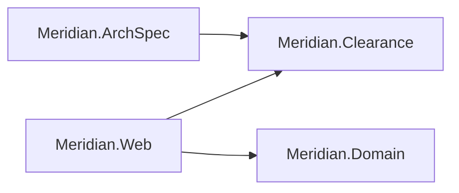
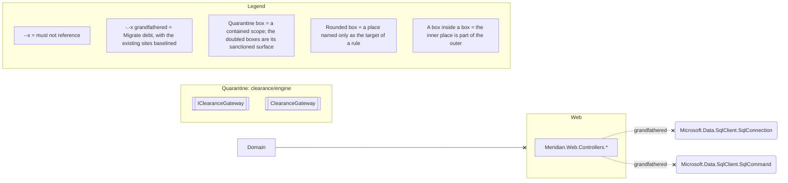

# Architecture: Meridian

Two drawings of the same monolith, both written by `loadbearing render` rather than by hand. The
first is the codebase survey: the projects and the references between them, drawn from what the code
does. The second is the architecture law, drawn from the spec instead.

Meridian carries all three postures at once, which makes its law fence the one place the difference
between them shows up as shapes rather than as words. A solid arrow is law this code already keeps.
A dotted arrow is grandfathered debt, baselined and counting down. A box inside a box is a
quarantined scope, and the doubled boxes are the only way into it.

<!-- loadbearing:begin -->
*Generated by `loadbearing render` from `Meridian.slnx` — do not edit between the markers; re-render to update.*



*Generated by `loadbearing render` from `Meridian.ArchSpec`. Do not edit between the markers; edit the spec and re-render.*



Not drawn in full: `naming/controllers`, `time/inject-clock` (Migrate), `naming/async-suffix` (Migrate), `di/no-buildserviceprovider`, `clearance/engine/tripwire` (Quarantine). Expand any of them with `loadbearing explain <rule-id>`.
<!-- loadbearing:end -->

The two dotted arrows into `SqlConnection` and `SqlCommand` are the burndown made visible. Twelve
inline-SQL references sit behind them, on the baseline and counting down as controllers move to
repositories. The arrow says the relation is forbidden; the dots say the sites that already exist
are spoken for. Nobody has to run `status` to see that this codebase is caught mid-migration,
because the drawing says so.

The quarantine box holds `Meridian.Clearance` and nothing else. `IClearanceGateway` and
`ClearanceGateway` are doubled because they are its sanctioned surface: the ISO 6346 check-digit
table inside is reached through them or not at all.

The line under the fence names the five rules no drawing can place. Four of them are about a name, a
call or a shape rather than a relation between two places, and the fifth is the quarantine tripwire,
which has nothing to draw by design. Each is listed by ID and expanded with
`loadbearing explain <rule-id>`, so the picture narrows and the law does not.

To redraw both from a checkout:

```bash
dotnet build examples/Meridian/Meridian.slnx
loadbearing render examples/Meridian/Meridian.slnx \
  --diagram examples/Meridian/ARCHITECTURE.md
```

Nothing on that line scopes the survey, and nothing needs to. A spec project references the
LoadBearing contract it is written against, so the build loads those projects too; the survey fence
draws only what `Meridian.slnx` declares, which is what makes the caption "Projects in this solution"
true rather than aspirational. `graph` is where the rest of the loaded set can be seen, each project
labelled with whether the solution declares it. The law fence is never scoped either, because what
the spec forbids is not a property of the projects someone chose to draw.
