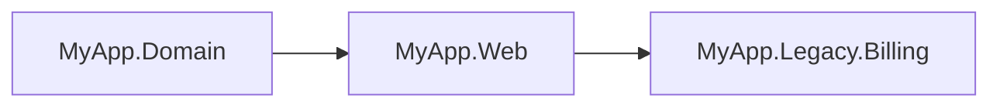
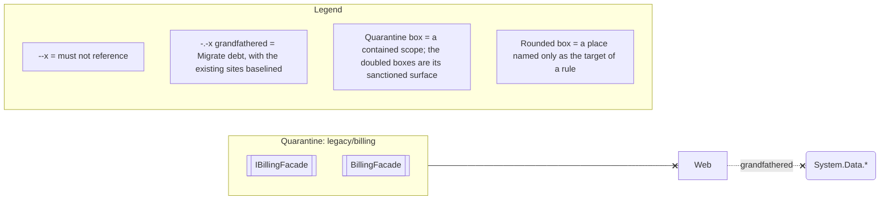

<!-- loadbearing:begin -->
*Generated by `loadbearing render` from `MyApp.sln` — do not edit between the markers; re-render to update.*

*Generated by `loadbearing render` from `Zphil.LoadBearing.MyAppRenderSpec`. Do not edit between the markers; edit the spec and re-render.*

Not drawn in full: `naming/interfaces`, `legacy/billing/tripwire` (Quarantine), `domain/retry-budget/tripwire` (Caution). Expand any of them with `loadbearing explain <rule-id>`.
<!-- loadbearing:end -->
