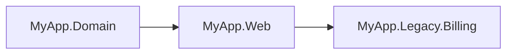

<!-- loadbearing:begin -->
*Generated by `loadbearing render` from `MyApp.sln` — do not edit between the markers; re-render to update.*

```mermaid
flowchart LR
    accTitle: Codebase survey: MyApp.sln
    accDescr: Projects in this solution and their cross-project references.

    p_MyApp_Domain["MyApp.Domain"]
    p_MyApp_Legacy_Billing["MyApp.Legacy.Billing"]
    p_MyApp_Web["MyApp.Web"]

    p_MyApp_Domain --> p_MyApp_Web
    p_MyApp_Web --> p_MyApp_Legacy_Billing
```
<!-- loadbearing:end -->
